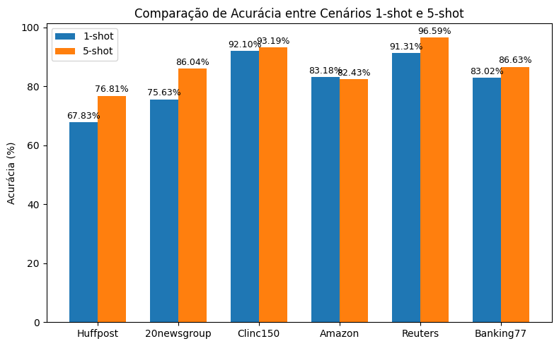

# LGPN

## Criação do ambiente Python

```bash
conda create -n LDS 
source activate LDS
pip install -r requirements.txt
```

## Ambiente na DGX

```bash
export PATH="/home/user_beatrizalmeida/.local/bin:$PATH"
# /cm/local/apps/python39/bin/python3 -m virtualenv ~/workspace/lgpn_venv
python3 -m venv ~/workspace/lgpn_venv
source ~/workspace/lgpn_venv/bin/activate

pip install --upgrade pip
pip install --upgrade setuptools wheel
# pip install torch torchvision torchaudio --index-url https://download.pytorch.org/whl/cu121
pip install -r requirements.txt
# ou 
pip install --no-build-isolation -r requirements.txt
```

## Execução rápida

```bash
cd scripts
sbatch executar_job.sh

# ou 
sh ours_all.sh
```
Ver job
```bash 
squeue -u user_beatrizalmeida # verificar andamento

tail -f laqda_saida_1113.log # ver saida em tempo real
scancel 1113 # cancelar job
```
Os parâmetros utilizados no artigo são consistentes com os definidos em `ours_all.sh`.

**Observação:** antes de iniciar, é necessário fazer o download do modelo [bert-base-uncased](https://huggingface.co/google-bert/bert-base-uncased) e atualizar o caminho no arquivo `ours_all.sh` para o local correspondente no seu ambiente.

## Resultados 

